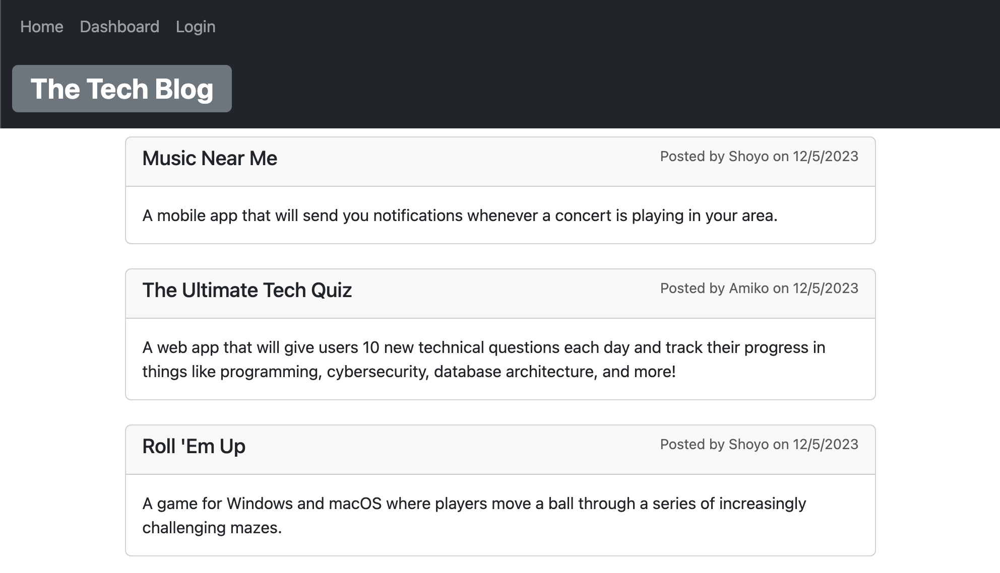
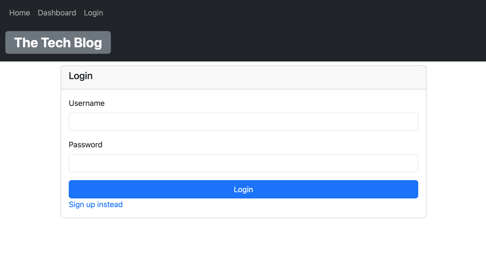
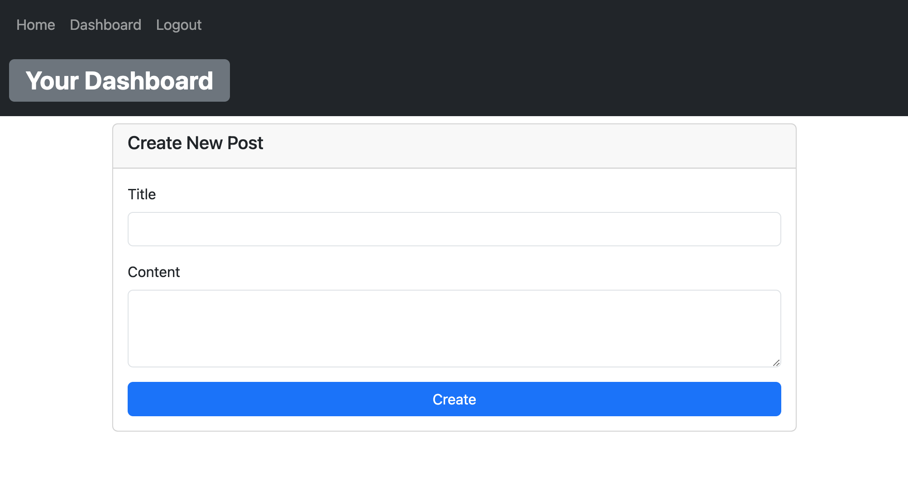

# The Tech Blog Post Application

## Description

This is a CMS-style blog site where developers can publish and post their ideas, latest technologies and advancements in the tech world. Developers are also able to comment on each post to share their ideas and opinions

## Screenshots of the application

## Credits

The underlying technologies used in this application are Express JS, MySQL, and Sequalize, please find the documentations below:
- [Express JS](https://expressjs.com/)
- [Mysql](https://www.npmjs.com/package/mysql2)
- [Sequalize](https://sequelize.org/docs/v6/getting-started/)
- [express-handlebars](https://www.npmjs.com/package/express-handlebars)
- [express-session](https://www.npmjs.com/package/express-session)
- [dotenv package](https://www.npmjs.com/package/dotenv)
- [bcrypt](https://www.npmjs.com/package/bcrypt)

## Link to deployed Application
- [Tech Blog App](https://techblog-app-shyo-5afd91631b2c.herokuapp.com/)
